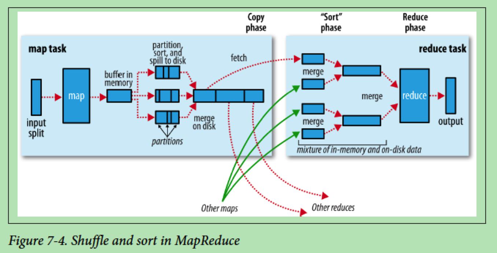

# MapReduce

## 资源

+ MapReduce: simplified data processing on large clusters, by Jeffrey Dean and Sanjay Ghemawat, 2008.

## 图例

### Hadoop如何运行MapReduce作业

### MapReduce系统中的状态是如何传播的

### MapReduce中shuffle和sort

## 概念

### 编写MapReduce程序

1. 编写mapper和reducer, 及其单元测试; 使用小数据集在IDE环境中测试;
2. 将程序部署到集群上, 调试;
3. 程序执行速度优化.

classpath:

- client: job JAR(包括其中的lib目录), `HADOOP_CLASSPATH`; 用环境变量`HADOOP_USER_CLASSPATH_FIRST`设置优先级
- task: job JAR(包括其中的lib目录), 使用`-libjars`选项或`org.apache.hadoop.mapreduce.Job.addFileToClassPath(Path)`添加到分布式缓存中的文件; 用配置`mapreduce.job.user.classpath.first`设置优先级

## Packages

### org.apache.hadoop.mapred

- `LocalJobRunner`: Implements MapReduce locally, in-process, for debugging.
- `MiniMRCluster`: deprecated, Use `MiniMRClientClusterFactory instead.
- `MiniMRClientClusterFactory`: A MiniMRCluster factory.

### org.apache.hadoop.mapreduce

- `Job`, `JobID`, `JobStatus`, `JobContext`
- `InputSplit`, `InputFormat<K,V>`, `OutputFormat<K,V>`
- `TaskID`, `TaskAttemptID`, `TaskCompletionEvent`, `TaskAttemptContext`, `TaskInputOutputContext<KEYIN,VALUEIN,KEYOUT,VALUEOUT>`, `TaskTrackerInfo`
- `Mapper<KEYIN,VALUEIN,KEYOUT,VALUEOUT>`, `MapContext<KEYIN,VALUEIN,KEYOUT,VALUEOUT>`, `RecordReader<KEYIN,VALUEIN>`
- `Reducer<KEYIN,VALUEIN,KEYOUT,VALUEOUT>`, `ReduceContext<KEYIN,VALUEIN,KEYOUT,VALUEOUT>`, `RecordWriter<K,V>`
