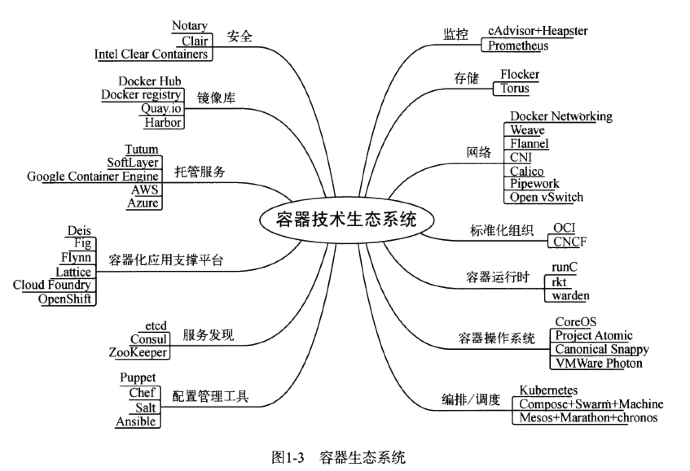
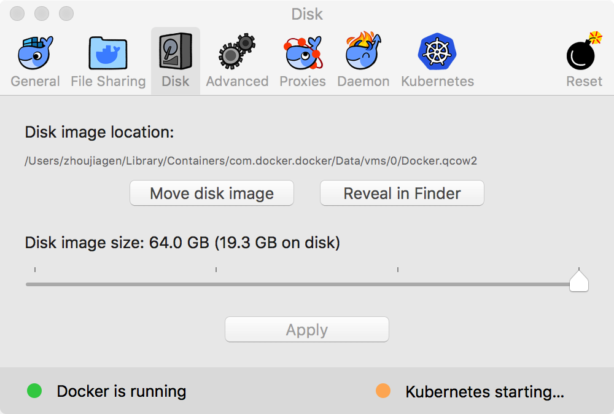

# Docker

>

## 资源

- 1 Docker容器与容器云 by 浙江大学SEL实验室
- 2 [Docker overview](https://docs.docker.com/engine/docker-overview/)
- 3 [Docker Documentation](https://docs.docker.com/)
- 4 [Kubernetes指南 by feiskyer](https://github.com/feiskyer/kubernetes-handbook)

### Problems

- [Docker on Mac Mojava is using 4GB even though it's configured for 2GB #3377](https://github.com/docker/for-mac/issues/3377): 容器可用和实际使用内存, `docker run -m 1g`, `docker stats`

- [Where is /var/lib/docker on Mac/OS X](https://stackoverflow.com/questions/38532483/where-is-var-lib-docker-on-mac-os-x)

```
$ screen ~/Library/Containers/com.docker.docker/Data/com.docker.driver.amd64-linux/tty

$ ctrl + a + d
$ screen ~/Library/Containers/com.docker.docker/Data/com.docker.driver.amd64-linux/tty
[detached]

```

## 概念

### 容器生态系统

容器生态系统(见[1]):




Docker引擎(见[Docker overview - Docker Engine](https://docs.docker.com/engine/docker-overview/)):


### 一个示例应用

见[1] 2.3.2:

- 获取镜像

```
docker pull ubuntu
docker pull django
docker pull haproxy
docker pull redis
```

- 启动容器并连接

```
docker run -it --name redis-master -v ~/Projects/Redis/Master:/data redis /bin/bash
docker run -it --name redis-slave1 --link redis-master:master -v ~/Projects/Redis/Slave1:/data redis /bin/bash
docker run -it --name redis-slave2 --link redis-master:master -v ~/Projects/Redis/Slave2:/data redis /bin/bash

docker run -it --name APP1 --link redis-master:db -v ~/Projects/Django/App1:/usr/src/app django /bin/bash
docker run -it --name APP2 --link redis-master:db -v ~/Projects/Django/App2:/usr/src/app django /bin/bash

docker run -it --name HAProxy --link APP1:APP1 --link APP2:APP2 -p 6301:6301 -v ~/Projects/HAProxy:/tmp haproxy /bin/bash
```

- 应用配置

```
$ tree ~/Projects/Redis/
├── Master
│   └── redis.conf
├── Slave1
│   └── redis.conf
└── Slave2
    └── redis.conf
```

`Master/redis.conf`(使用diff工具, 例如`$ diff ~/Downloads/redis.conf Master/redis.conf`):

```
#bind 127.0.0.1
protected-mode no
daemonize yes
pidfile /var/run/redis.pid
logfile "master.log"
```

`Slave1/redis.conf`:

```
#bind 127.0.0.1
protected-mode no
daemonize yes
pidfile /var/run/redis.pid
logfile "slave1.log"
replicaof master 6379
```

`Slave2/redis.conf`:

```
#bind 127.0.0.1
protected-mode no
daemonize yes
pidfile /var/run/redis.pid
logfile "slave2.log"
replicaof master 6379
```

使用`redis-cli`测试.


- Django & HAProxy

```
pip install redis

cd usr/src/app/
mkdir dockerweb
cd dockerweb/
django-admin.py startproject redisweb
cd redisweb/
python manage.py startapp helloworld
python manage.py makemigrations
python manage.py migrate
python manage.py runserver 0.0.0.0:8001
```

```
cd /tmp/
cp haproxy.cfg /usr/local/sbin/
cd /usr/local/sbin/
haproxy -f haproxy.cfg
```

### namespaces, cgroups

## RTFSC

- [Docker CE](https://github.com/docker/docker-ce) componnets: [docker/docker-ce-packaging](https://github.com/docker/docker-ce-packaging), [moby/moby](https://github.com/moby/moby), [docker/cli](https://github.com/docker/cli)
- [Moby projects](https://mobyproject.org/projects/): Moby is an open-source project, created by Docker, to enable and accelerate software containerization.
- [containerd](https://containerd.io/):An industry-standard container runtime with an emphasis on simplicity, robustness and portability - [Containerd 简介](https://www.cnblogs.com/sparkdev/p/9063042.html)
- [opencontainers/runc](https://github.com/opencontainers/runc): CLI tool for spawning and running containers according to the OCI specification - [RunC 简介](https://www.cnblogs.com/sparkdev/p/9032209.html)

## Ops

### 安装

- [Get started with Docker Desktop for Mac](https://docs.docker.com/docker-for-mac/)

```
$ docker --version
Docker version 18.05.0-ce-rc1, build 33f00ce
```



### CLI

- [Use the Docker command line](https://docs.docker.com/engine/reference/commandline/cli/)
- [wsargent/docker-cheat-sheet](https://github.com/wsargent/docker-cheat-sheet/tree/master/zh-cn)


```
$ docker

Usage:	docker COMMAND

A self-sufficient runtime for containers

Options:
      --config string         Location of client config files (default "/Users/zhoujiagen/.docker")
  -D, --debug                 Enable debug mode
  -H, --host list             Daemon socket(s) to connect to
  -l, --log-level string      Set the logging level ("debug"|"info"|"warn"|"error"|"fatal") (default "info")
      --orchestrator string   Which orchestrator to use with the docker cli (swarm|kubernetes) (default swarm) (experimental)
      --tls                   Use TLS; implied by --tlsverify
      --tlscacert string      Trust certs signed only by this CA (default "/Users/zhoujiagen/.docker/ca.pem")
      --tlscert string        Path to TLS certificate file (default "/Users/zhoujiagen/.docker/cert.pem")
      --tlskey string         Path to TLS key file (default "/Users/zhoujiagen/.docker/key.pem")
      --tlsverify             Use TLS and verify the remote
  -v, --version               Print version information and quit

Management Commands: 管理命令
  checkpoint  Manage checkpoints
  ...

Commands: 命令
  attach      Attach local standard input, output, and error streams to a running container
  ...

Run 'docker COMMAND --help' for more information on a command.
```

管理命令:

|命令|描述|
|:---|:---|
|checkpoint|Manage checkpoints|
|container| Manage containers|
|image| Manage images|
|manifest|Manage Docker image manifests and manifest lists|
|network| Manage networks|
|plugin|Manage plugins|
|system|Manage Docker|
|trust| Manage trust on Docker images|
|volume|Manage volumes|


命令:

|命令|描述|
|:---|:---|
|attach|Attach local standard input, output, and error streams to a running container|
|build| Build an image from a Dockerfile|
|commit|Create a new image from a container's changes|
|cp|Copy files/folders between a container and the local filesystem|
|create|Create a new container|
|diff|Inspect changes to files or directories on a container's filesystem|
|events|Get real time events from the server|
|exec|Run a command in a running container|
|export|Export a container's filesystem as a tar archive|
|history| Show the history of an image|
|images|List images|
|import|Import the contents from a tarball to create a filesystem image|
|info|Display system-wide information|
|inspect| Return low-level information on Docker objects|
|kill|Kill one or more running containers|
|load|Load an image from a tar archive or STDIN|
|login| Log in to a Docker registry|
|logout|Log out from a Docker registry|
|logs|Fetch the logs of a container|
|pause| Pause all processes within one or more containers|
|port|List port mappings or a specific mapping for the container|
|ps|List containers|
|pull|Pull an image or a repository from a registry|
|push|Push an image or a repository to a registry|
|rename|Rename a container|
|restart| Restart one or more containers|
|rm|Remove one or more containers|
|rmi| Remove one or more images|
|run| Run a command in a new container|
|save|Save one or more images to a tar archive (streamed to STDOUT by default)|
|search|Search the Docker Hub for images|
|start| Start one or more stopped containers|
|stats| Display a live stream of container(s) resource usage statistics|
|stop|Stop one or more running containers|
|tag| Create a tag TARGET_IMAGE that refers to SOURCE_IMAGE|
|top| Display the running processes of a container|
|unpause| Unpause all processes within one or more containers|
|update|Update configuration of one or more containers|
|version| Show the Docker version information|
|wait|Block until one or more containers stop, then print their exit codes|


示例:

```
# create image
$ docker build -t friendlyhello .

# view the images
$ docker image ls

# run & access the app
docker run -p 4000:80 friendlyhello
http://localhost:4000/
docker run -d -p 4000:80 friendlyhello

# view the containers
$ docker container ls

# stop container:
docker container stop f11c79f8ef8e

# tag & publish the image:
docker tag <image> <username>/<repository>:<tag>
docker push <username>/<repository>:<tag>
# pull & run:
docker run -p 4000:80 <username>/<repository>:<tag>
```

### Docker Hub


#### Java

- [Docker for Java Developers](https://github.com/docker/labs/tree/master/developer-tools/java/): This tutorial offers Java developers an intro-level and self-paced hands-on workshop with Docker.
- [GoogleContainerTools/jib](https://github.com/GoogleContainerTools/jib): Build container images for your Java applications.

Dockerfile:

```
FROM ubuntu:14.04

LABEL maintainer="zhoujiagen@gmail.com" \
      version="1.0.0" \
      description="Base of Java Environment"

#USER zhoujiagen
#WORKDIR /tmp

### set ubuntu mirror
#RUN mv /etc/apt/sources.list /etc/apt/sources.list.bak
#COPY tuna-sources.list /etc/apt/sources.list

### install ssh
RUN apt-get update && apt-get -y install ssh

### install java
# get add-apt-repository
RUN apt-get -y install software-properties-common python-software-properties
RUN add-apt-repository ppa:openjdk-r/ppa
RUN apt-get update && apt-get -y --force-yes install openjdk-8-jdk
# set environment
ENV JAVA_HOME=/usr/lib/jvm/java-8-openjdk-amd64
ENV CLASSPATH=.:$JAVA_HOME/lib

CMD ["cat", "/etc/hosts"]
```

```
$ docker build --force-rm -t javaenv:1.0.0 .
$ docker run -it --name javaenv -p 22:22 javaenv:1.0.0 /bin/bash
$ docker container start -i javaenv
```

#### MySQL

- [docker-library/mysql](https://github.com/docker-library/mysql)

```
docker run -p 3306:3306 --name mysql5.7 -v $PWD/conf:/etc/mysql/conf.d -v $PWD/logs:/logs -v $PWD/data:/mysql_data -e MYSQL_ROOT_PASSWORD=root -d mysql --default-authentication-plugin=mysql_native_password
```

#### OpenTSDB

- [OpenTSDB 2.3 documentation - Additional Resources - Docker Images](http://opentsdb.net/docs/build/html/resources.html#docker-images)

Dockerfile:

```
#FROM ubuntu:14.04
FROM centos

ENV TSDB_VERSION 2.3.1
ENV JAVA_HOME /usr/lib/jvm/java-1.8.0-openjdk.x86_64
ENV PATH $PATH:/usr/lib/jvm/java-1.8.0-openjdk.x86_64/bin/


MAINTAINER zhoujiagen@gmail.com

ADD opentsdb-2.3.1.noarch.rpm /usr/local/src
ADD opentsdb.conf /usr/local/src

WORKDIR /usr/local/src/

#RUN yum install -y net-tools
RUN yum install -y gnuplot
RUN rpm -ivh opentsdb-2.3.1.noarch.rpm
RUN chmod +x /usr/share/opentsdb/bin/tsdb

RUN yum -y install java-1.8.0-openjdk.x86_64


EXPOSE 4242

#CMD ["/usr/share/opentsdb/bin/tsdb", "tsd", "--config=opentsdb.conf", "--port=4242", "--zkquorum=127.0.0.1:2181"]


# cd /usr/local/src
# /usr/share/opentsdb/bin/tsdb tsd --config=opentsdb.conf --port=4242 --zkquorum=192.168.31.14:2181
```

```
$ docker build -t opentsdb:2.3.1 .
$ docker run -d  -p 4242:4242 opentsdb:2.3.1
```

#### AllegroGraph

Dockerfile:

```
FROM ubuntu:14.04

LABEL maintainer="zhoujiagen@gmail.com" \
      version="1.0.0" \
      description="Non tuned environment of AllegroGraph"

RUN mkdir -p /opt/AllegroGraph && mkdir -p /opt/AllegroGraph/tmp/ag6.4.2/

WORKDIR /opt/AllegroGraph
#RUN apt-get update && apt-get -y install wget
#RUN curl http://franz.com/ftp/pri/acl/ag/ag6.4.2/linuxamd64.64/agraph-6.4.2-linuxamd64.64.tar.gz
COPY agraph-6.4.2-linuxamd64.64.tar.gz /opt/AllegroGraph/agraph-6.4.2-linuxamd64.64.tar.gz
RUN tar zxf agraph-6.4.2-linuxamd64.64.tar.gz && cd agraph-6.4.2

# interactive
#RUN /opt/AllegroGraph/agraph-6.4.2/install-agraph /opt/AllegroGraph/tmp/ag6.4.2/
# /opt/AllegroGraph/tmp/ag6.4.2/bin/agraph-control --config /opt/AllegroGraph/tmp/ag6.4.2/lib/agraph.cfg start
#CMD ["/opt/AllegroGraph/tmp/ag6.4.2/bin/agraph-control", "--config", "/opt/AllegroGraph/tmp/ag6.4.2/lib/agraph.cfg", "start"]

EXPOSE 10035
```

```
$ docker build --force-rm -t agraph:1.0.0 .
$ docker login
$ docker image tag agraph:1.0.0 zhoujiagen/agraph:1.0.0
$ docker push zhoujiagen/agraph:1.0.0
```

```
$ docker run -it --name agraph -p 10035:10035 agraph:1.0.0 /bin/bash
```
